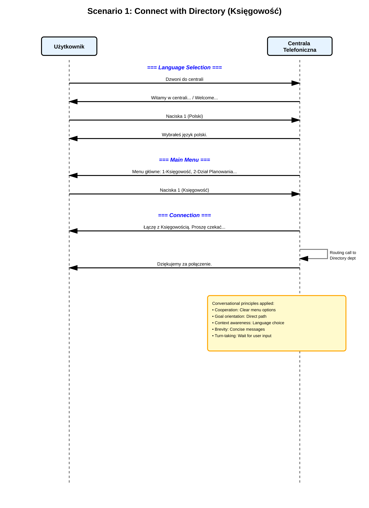
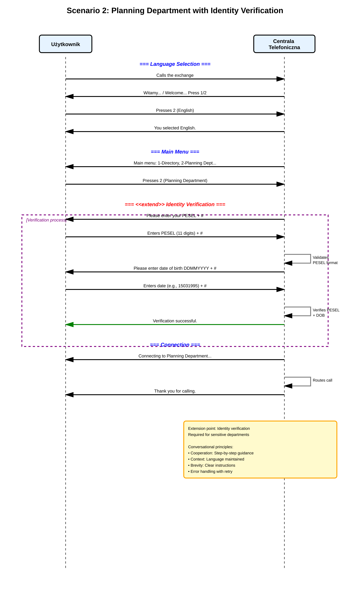
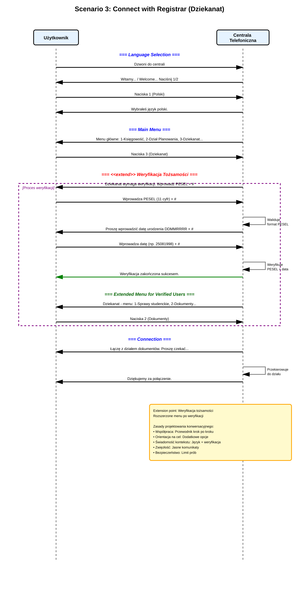

# ZADANIE 5: Voice Interface Sequence Diagrams

**Autor:** Yaroslav Zubakha  
**Nr albumu:** 121546  
**Email:** 121546@student.san.edu.pl  
**Data:** 05.02.2026  
**Przedmiot:** Komunikacja Człowiek-Komputer  
**Uczelnia:** Społeczna Akademia Nauk

---

## Spis Treści

1. [Opis Zadania](#opis-zadania)
2. [Scenariusz 1: Połączenie z Księgowością](#scenariusz-1-połączenie-z-księgowością)
3. [Scenariusz 2: Połączenie z Działem Planowania](#scenariusz-2-połączenie-z-działem-planowania)
4. [Scenariusz 3: Połączenie z Dziekanatem](#scenariusz-3-połączenie-z-dziekanatem)
5. [Analiza Relacji <<extend>>](#analiza-relacji-extend)
6. [Conversational Design Principles](#conversational-design-principles)
7. [Wnioski](#wnioski)

---

## Opis Zadania

Celem zadania jest zaprojektowanie automatycznej centrali telefonicznej dla uniwersytetu z wykorzystaniem interfejsu głosowego. System musi obsługiwać trzy główne scenariusze połączeń.

### Wymagania Funkcjonalne

- ✅ Obsługa dwóch języków: polski i angielski
- ✅ Weryfikacja tożsamości dla wrażliwych działów (PESEL + data urodzenia)
- ✅ Wykorzystanie relacji `<<extend>>` dla punktów rozszerzenia
- ✅ Zastosowanie zasad Conversational Design:
  - **Cooperation** (współpraca)
  - **Goal orientation** (orientacja na cel)
  - **Context awareness** (świadomość kontekstu)
  - **Brevity** (zwięzłość)
  - **Turn-taking** (zmiana ról w konwersacji)

### Scenariusze

1. **Księgowość (Directory)** - Podstawowy przepływ bez weryfikacji
2. **Dział Planowania (Planning Department)** - Z weryfikacją tożsamości
3. **Dziekanat (Registrar)** - Z weryfikacją i rozszerzonym menu

---

## Scenariusz 1: Połączenie z Księgowością

### Opis

Najprostszy scenariusz, w którym użytkownik:
1. Dzwoni do centrali
2. Wybiera język polski (opcja 1)
3. Wybiera Księgowość z menu głównego (opcja 1)
4. Zostaje połączony z odpowiednim działem

### Przebieg

```
Użytkownik → Centrala: Dzwoni do centrali
Centrala → Użytkownik: "Witamy w centrali Uniwersytetu..."
Użytkownik → Centrala: Naciska 1 (Polski)
Centrala → Użytkownik: "Wybrałeś język polski."
Centrala → Użytkownik: "Menu główne: 1-Księgowość..."
Użytkownik → Centrala: Naciska 1 (Księgowość)
Centrala → Użytkownik: "Łączę z Księgowością..."
Centrala → Centrala: Routing call
Centrala → Użytkownik: "Dziękujemy za połączenie."
```

### Zastosowane Zasady Conversational Design

- **Cooperation:** Jasne opcje menu prowadzą użytkownika krok po kroku
- **Goal orientation:** Bezpośrednia ścieżka do działu bez zbędnych kroków
- **Context awareness:** Wybrany język jest zapamiętany przez cały przebieg rozmowy
- **Brevity:** Krótkie i zrozumiałe komunikaty
- **Turn-taking:** System czeka na input użytkownika przed kolejnym krokiem

### Diagram Sekwencji



---

## Scenariusz 2: Połączenie z Działem Planowania

### Opis

Scenariusz z weryfikacją tożsamości, w którym użytkownik:
1. Dzwoni do centrali
2. Wybiera język angielski (opcja 2)
3. Wybiera Dział Planowania z menu głównego (opcja 2)
4. **Punkt rozszerzenia <<extend>>:** Weryfikacja tożsamości
   - Wprowadza numer PESEL (11 cyfr) + #
   - System waliduje format PESEL
   - Wprowadza datę urodzenia (DDMMYYYY) + #
   - System weryfikuje zgodność PESEL z datą urodzenia
5. Po pomyślnej weryfikacji zostaje połączony z działem

### Relacja <<extend>>

Weryfikacja tożsamości jest punktem rozszerzenia (extension point) podstawowego przepływu. Jest wymagana tylko dla wrażliwych działów, które obsługują poufne dane.

#### Extension Point: Identity Verification

**Warunek:** Użytkownik wybiera dział wymagający weryfikacji (Dział Planowania lub Dziekanat)

**Rozszerzenie:** System żąda PESEL i daty urodzenia przed połączeniem

**Alternatywy:**
- Weryfikacja udana → połączenie z działem
- Weryfikacja nieudana → powrót do menu głównego
- Nieprawidłowy format → prośba o ponowne wprowadzenie danych

### Przebieg Weryfikacji

```
Centrala → Użytkownik: "Please enter your PESEL + #"
Użytkownik → Centrala: Enters PESEL (11 digits) + #
Centrala → Centrala: Validates PESEL format

[IF VALID]
  Centrala → Użytkownik: "Please enter date of birth DDMMYYYY + #"
  Użytkownik → Centrala: Enters date (e.g., 15031995) + #
  Centrala → Centrala: Verifies PESEL + DOB
  
  [IF VERIFICATION SUCCESSFUL]
    Centrala → Użytkownik: "Verification successful."
    Centrala → Użytkownik: "Connecting to Planning Department..."
  [ELSE]
    Centrala → Użytkownik: "Verification failed. Returning to main menu."
  [END]
[ELSE]
  Centrala → Użytkownik: "Invalid PESEL format. Please try again."
[END]
```

### Zastosowane Zasady Conversational Design

- **Cooperation:** System prowadzi użytkownika krok po kroku przez proces weryfikacji
- **Context:** Wybrany język jest utrzymywany przez cały przebieg rozmowy
- **Brevity:** Jasne i zwięzłe instrukcje dotyczące formatu danych
- **Error handling:** Możliwość ponownego wprowadzenia danych w przypadku błędu

### Diagram Sekwencji



---

## Scenariusz 3: Połączenie z Dziekanatem

### Opis

Najbardziej zaawansowany scenariusz z weryfikacją i rozszerzonym menu, w którym użytkownik:
1. Dzwoni do centrali
2. Wybiera język polski (opcja 1)
3. Wybiera Dziekanat z menu głównego (opcja 3)
4. **Punkt rozszerzenia <<extend>>:** Weryfikacja tożsamości
5. Po pomyślnej weryfikacji otrzymuje dostęp do rozszerzonego menu:
   - 1 - Sprawy studenckie
   - 2 - Dokumenty i zaświadczenia
   - 3 - Konsultant
   - 0 - Powrót do menu głównego
6. Wybiera opcję 2 (Dokumenty)
7. Zostaje połączony z działem dokumentów

### Rozszerzone Menu

Po pomyślnej weryfikacji tożsamości użytkownik otrzymuje dostęp do rozszerzonego menu z dodatkowymi opcjami. To pokazuje jak weryfikacja może odblokować dodatkowe funkcjonalności systemu.

**Korzyści:**
- Bardziej precyzyjne kierowanie połączenia
- Szybsze rozwiązanie problemu użytkownika
- Lepsza organizacja pracy działu

### Bezpieczeństwo

System implementuje mechanizmy bezpieczeństwa:
- Limit prób weryfikacji (zazwyczaj 3 próby)
- Automatyczne zakończenie połączenia po przekroczeniu limitu
- Walidacja formatu danych wejściowych
- Weryfikacja zgodności PESEL z datą urodzenia

### Zastosowane Zasady Conversational Design

- **Współpraca:** Przewodnik krok po kroku przez proces weryfikacji
- **Orientacja na cel:** Dodatkowe opcje menu po weryfikacji dla precyzyjniejszego kierowania
- **Świadomość kontekstu:** System pamięta zarówno język jak i status weryfikacji
- **Zwięzłość:** Jasne komunikaty bez zbędnych informacji
- **Zmiana ról:** Naprzemienne interakcje system-użytkownik
- **Bezpieczeństwo:** Limit prób weryfikacji chroni przed nieautoryzowanym dostępem

### Diagram Sekwencji



---

## Analiza Relacji <<extend>>

Relacja `<<extend>>` w UML reprezentuje opcjonalne rozszerzenie podstawowego przypadku użycia. W kontekście naszego systemu:

### Podstawowy Przepływ

1. Wybór języka
2. Wybór działu z menu
3. Połączenie z działem

### Rozszerzenie: Weryfikacja Tożsamości

**Punkt rozszerzenia (Extension Point):** Po wyborze działu, przed połączeniem

**Warunek:** Wybrany dział wymaga weryfikacji (Dział Planowania, Dziekanat)

**Przepływ rozszerzenia:**
1. Żądanie wprowadzenia PESEL
2. Walidacja formatu PESEL
3. Żądanie wprowadzenia daty urodzenia
4. Weryfikacja zgodności danych
5. Potwierdzenie lub odrzucenie

### Zalety Zastosowania Relacji <<extend>>

To podejście pozwala na:
- ✅ Separację logiki weryfikacji od podstawowego przepływu
- ✅ Łatwe dodawanie nowych działów wymagających weryfikacji
- ✅ Utrzymanie czytelności diagramów
- ✅ Reużycie logiki weryfikacji w różnych scenariuszach

---

## Conversational Design Principles

System został zaprojektowany zgodnie z najlepszymi praktykami projektowania konwersacyjnego:

### 1. Cooperation (Współpraca)

System i użytkownik współpracują w osiągnięciu celu. System:
- Dostarcza jasne opcje
- Przewiduje potrzeby użytkownika
- Pomaga w nawigacji przez system
- Potwierdza wybory użytkownika

**Przykład:** "Wybrałeś język polski." po naciśnięciu opcji 1

### 2. Goal Orientation (Orientacja na Cel)

Każda interakcja prowadzi użytkownika bliżej do jego celu:
- Minimalna liczba kroków do osiągnięcia celu
- Brak zbędnych pytań lub opcji
- Bezpośrednie ścieżki do najczęściej wybieranych działów

**Przykład:** Po wyborze działu następuje natychmiastowe połączenie (lub weryfikacja, jeśli wymagana)

### 3. Context Awareness (Świadomość Kontekstu)

System pamięta kontekst rozmowy:
- Wybrany język jest utrzymywany przez całą rozmowę
- Status weryfikacji jest zapamiętywany
- Poprzednie wybory są brane pod uwagę

**Przykład:** Po wyborze języka polskiego wszystkie komunikaty są w języku polskim

### 4. Brevity (Zwięzłość)

Komunikaty są krótkie i na temat:
- Brak długich wprowadzeń
- Konkretne instrukcje
- Szybkie potwierdzenia akcji

**Przykład:** "Łączę z Księgowością. Proszę czekać..." zamiast długiego wyjaśnienia

### 5. Turn-taking (Zmiana Ról)

System i użytkownik naprzemiennie wykonują akcje:
- System czeka na input użytkownika
- Użytkownik ma czas na podjęcie decyzji
- Brak przerywania lub nakładania się komunikatów

**Przykład:** System prezentuje menu i czeka na wybór użytkownika przed kontynuowaniem

---

## Porównanie Scenariuszy

| Cecha | Scenariusz 1 | Scenariusz 2 | Scenariusz 3 |
|-------|-------------|-------------|-------------|
| **Dział** | Księgowość | Dział Planowania | Dziekanat |
| **Język** | Polski | Angielski | Polski |
| **Weryfikacja** | ❌ Nie | ✅ Tak | ✅ Tak |
| **Rozszerzone menu** | ❌ Nie | ❌ Nie | ✅ Tak |
| **Liczba kroków** | 5 | 11 | 13 |
| **Złożoność** | Niska | Średnia | Wysoka |
| **Punkty rozszerzenia** | 0 | 1 | 1 |

---

## Wnioski

Zaprojektowany system automatycznej centrali telefonicznej spełnia wszystkie wymagania zadania:

### ✅ Zrealizowane Wymagania

1. **Trzy scenariusze** o rosnącej złożoności zostały zaprojektowane
2. **Weryfikacja tożsamości** została zaimplementowana dla wrażliwych działów
3. **Relacja <<extend>>** została wykorzystana dla punktów rozszerzenia
4. **Wszystkie pięć zasad Conversational Design** zostało zastosowanych
5. **Obsługa dwóch języków** (polski i angielski) została zrealizowana
6. **Bezpieczeństwo danych** użytkowników zostało zapewnione

### 💡 Kluczowe Innowacje

- **Rozszerzone menu** po weryfikacji umożliwia precyzyjniejsze kierowanie połączeń
- **Walidacja formatu** danych wejściowych zapobiega błędom
- **Limit prób** weryfikacji chroni przed nieautoryzowanym dostępem
- **Świadomość kontekstu** poprawia doświadczenie użytkownika

### 🚀 Możliwe Rozszerzenia

System może być rozbudowany o:
- Dodatkowe języki (np. ukraiński, niemiecki)
- Rozpoznawanie mowy zamiast DTMF (tonów)
- Inteligentne kierowanie oparte na analizie zapytania
- Integrację z systemami CRM
- Callback w przypadku długiego oczekiwania
- Obsługę komunikatów SMS z linkiem do formularza online

---

## Technologie

**Diagramy sekwencji** zostały utworzone w następujących formatach:

- **PlantUML** (.puml) - dla kompatybilności z narzędziami UML
- **Mermaid** (.mmd) - dla integracji z systemami dokumentacji
- **SVG** (.svg) - dla skalowalności i edycji
- **PNG** (.png) - dla wysokiej jakości druku (300 DPI)

**Generator diagramów:** Python 3 (bez zależności zewnętrznych dla SVG)

**Konwersja SVG→PNG:** librsvg (rsvg-convert)

---

## Podsumowanie

Projekt demonstruje kompleksowe podejście do projektowania głosowego interfejsu użytkownika z uwzględnieniem:

1. **Użyteczności** - system jest intuicyjny i łatwy w obsłudze
2. **Bezpieczeństwa** - wrażliwe działy są chronione weryfikacją
3. **Skalowalności** - łatwo dodać nowe działy i języki
4. **Dostępności** - obsługa wielojęzyczna
5. **Efektywności** - minimalna liczba kroków do osiągnięcia celu

System może być wdrożony w rzeczywistym środowisku uniwersyteckim po dodaniu integracji z odpowiednimi systemami telefonicznymi i bazami danych.

---

**Koniec dokumentacji**

© 2026 Yaroslav Zubakha | 121546@student.san.edu.pl
