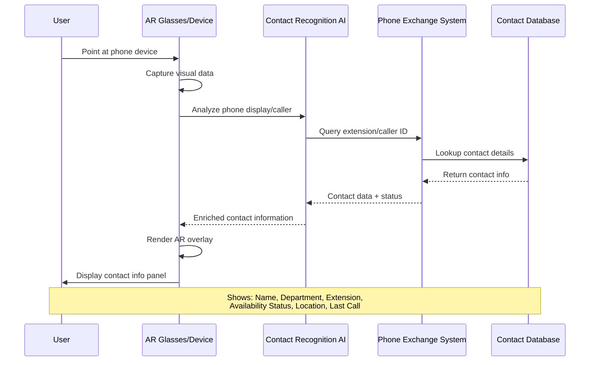

## Use Case 1: Contact Recognition & Info Overlay

**Description:** When user looks at a phone or incoming call, AR system identifies the contact and displays comprehensive information overlay.

**Actors:** 
- User (faculty/staff member)
- AR Device (smart glasses or phone with AR)
- Contact Recognition AI
- PBX System
- Contact Database

**Trigger:** User directs gaze/camera toward phone device or receives call

**Flow:**
1. AR device captures visual data of phone display
2. Recognition AI analyzes caller ID or extension number
3. System queries PBX for real-time contact information
4. Database provides full contact profile
5. AR overlay renders contact card with targeting reticle
6. Display shows: name, department, extension, availability, office location, call history
