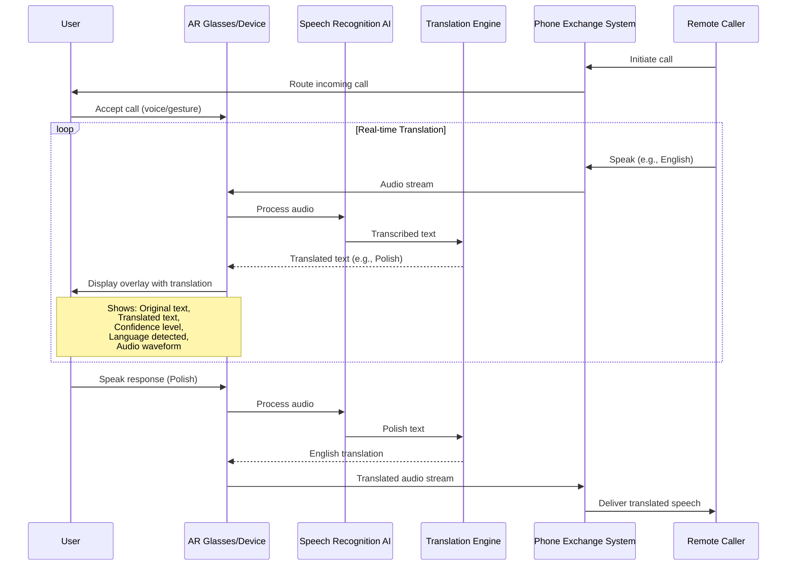

## Use Case 2: Real-time Translation Overlay

**Description:** During international calls, AR system provides live translation with original and translated text displayed as HUD overlay, plus audio waveform visualization.

**Actors:**
- User (university staff)
- AR Device
- Speech Recognition AI
- Translation Engine
- PBX System
- Remote Caller (international partner/student)

**Trigger:** Incoming call from non-native speaker or international contact

**Flow:**
1. User accepts incoming call through AR interface
2. Audio stream is processed by speech recognition AI
3. Transcribed text is sent to translation engine
4. Translated text appears in real-time overlay
5. System shows confidence level and detected language
6. Waveform visualization helps user track speaking rhythm
7. Bidirectional translation for user's responses
8. Both parties communicate in their native languages
