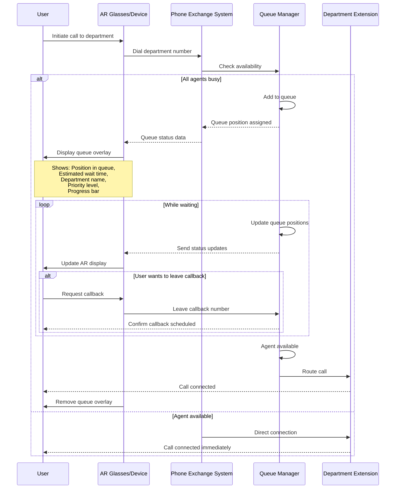

## Use Case 3: Call Queue Status & Wait Time Visualization

**Description:** When calling busy department, AR overlay displays real-time queue position, estimated wait time with progress bar, and option to schedule callback.

**Actors:**
- User (caller)
- AR Device
- PBX System
- Queue Manager
- Department Extension

**Trigger:** User dials department extension that is busy/all agents occupied

**Flow:**
1. User initiates call to department (e.g., IT Support)
2. PBX checks agent availability
3. If busy, Queue Manager assigns position
4. AR overlay displays queue information panel
5. Progress bar shows relative wait time
6. System continuously updates position and estimate
7. User can opt for callback instead of waiting
8. When agent available, call is connected
9. Queue overlay automatically dismissed
