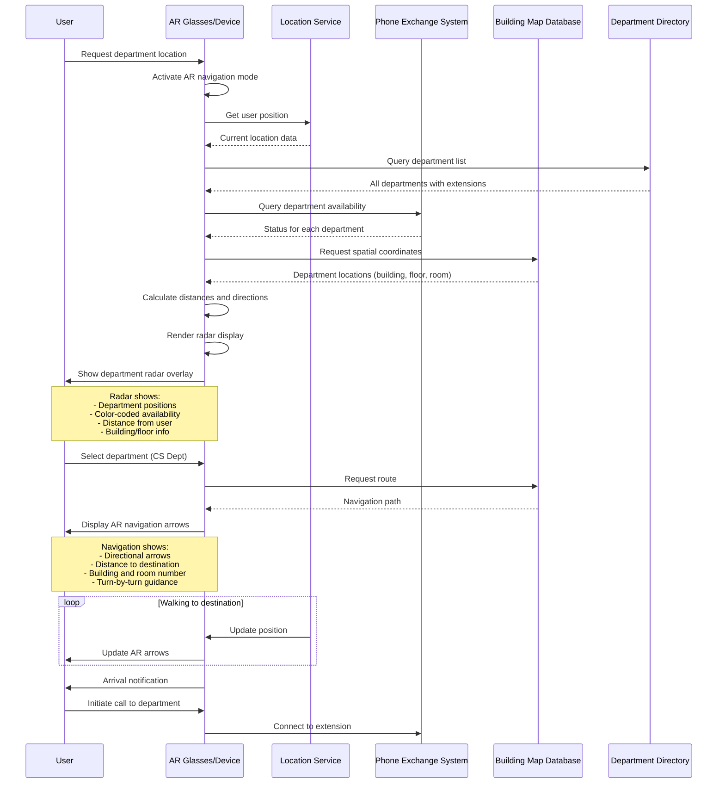

## Use Case 4: Department Location & Navigation with Radar Display

**Description:** AR radar shows spatial positions of all university departments with availability status. When selected, provides turn-by-turn AR navigation to physical office location.

**Actors:**
- User (visitor, student, or staff)
- AR Device
- Location Service (GPS/indoor positioning)
- PBX System
- Building Map Database
- Department Directory

**Trigger:** User needs to find and contact a department (e.g., Computer Science, Admin, Library)

**Flow:**
1. User activates department finder in AR interface
2. Location service determines user's current position
3. System queries all departments and their availability
4. Building map provides spatial coordinates
5. AR radar overlay displays departments as colored dots:
   - Green: Available
   - Orange: Busy
   - Red: Offline/Closed
6. User selects target department
7. Navigation route is calculated
8. AR arrows and distance overlay guides user
9. Turn-by-turn directions update as user walks
10. Upon arrival, quick-dial option to call department extension
