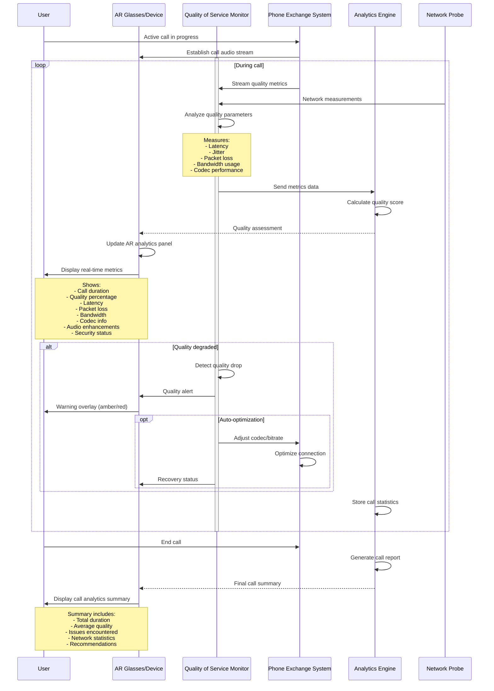

## Use Case 5: Call Analytics & Quality Monitoring

**Description:** Real-time overlay displaying comprehensive call quality metrics, network statistics, and audio processing status in aviation HUD style with connection visualization.

**Actors:**
- User (caller)
- AR Device
- Quality of Service Monitor
- PBX System
- Analytics Engine
- Network Probe

**Trigger:** Active call in progress

**Flow:**
1. User is on active call through university PBX
2. QoS Monitor begins collecting quality metrics
3. Network probe measures latency, jitter, packet loss
4. Analytics engine calculates overall quality score
5. AR panel displays real-time metrics:
   - Call duration (00:03:47)
   - Quality percentage (98% - Excellent)
   - Network latency (23ms)
   - Packet loss (0.1%)
   - Bandwidth usage (64 kbps)
   - Active codec (Opus 48kHz)
   - Audio enhancements (noise reduction, echo cancellation)
   - Encryption status (AES-256)
6. Connection line visualizes data flow
7. If quality degrades, warning indicators appear
8. System may auto-adjust codec or suggest actions
9. After call ends, summary report is displayed
10. Historical analytics available for troubleshooting
